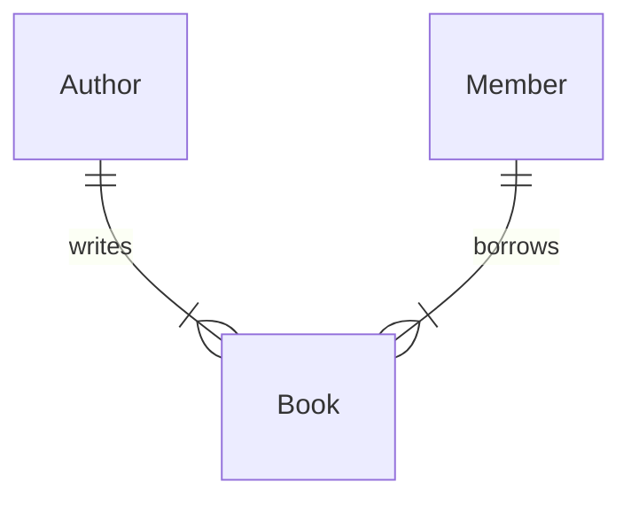

# Library Management System - Database Design Specification

## 1. Overview
- **System** : Alexandria
- **Engine** : PostgreSQL 15+
- **Purpose** : ALexandria is a web-based application designed to help librarians manage books, members, borrowing, returns, fines, and notifications.

## 2. Relationships (ERD)

## 3. Tables

### `book`
*Purpose: Stores the details of all the books available in the Library.*

| Column | Type | Constraints | Description |
| :--- | :--- | :--- | :--- |
| `B_id` | UUID | PK, NOT NULL | Primary key |
| `B_name` | VARCHAR(255) | NOT NULL | Book Name |
| `ISBN` | UUID | UNIQUE, NOT NULL | ISBN |
| `Pub_Year` | smallint | NOT NULL | Year published |
| `A_id` | UUID | FK, NOT NULL | Foreign Key, Author Id |
| `B_isAvailable` | bool | NOT NULL | Whether the book is available for lending |

### `Author`
*Purpose: Stores the details of authors of the books in the Library.*

| Column | Type | Constraints | Description |
| :--- | :--- | :--- | :--- |
| `A_id` | UUID | PK, NOT NULL | Primary key |
| `A_name` | VARCHAR(255) | NOT NULL | Author Name |

### `Member`
*Purpose: Stores the details of all the members in the Library.*

| Column | Type | Constraints | Description |
| :--- | :--- | :--- | :--- |
| `M_id` | UUID | PK, NOT NULL | Primary key |
| `M_name` | VARCHAR(255) | NOT NULL | Member Name |
| `M_enrollDate` | date | NOT NULL | Member Enroll date |
| `M_email` | VARCHAR(255) | UNIQUE, NOT NULL | Member Email |
| `M_image` | VARCHAR(255) | NOT NULL | Member Image |

### `Book Lending`
*Purpose: Stores the details of all the books borrowed by the members.*

| Column | Type | Constraints | Description |
| :--- | :--- | :--- | :--- |
| `L_id` | UUID | PK, NOT NULL | Primary key |
| `B_id` | UUID | FK, NOT NULL | Foreign key |
| `M_id` | UUID | FK, NOT NULL | Foreign key |
| `lend_Date` | date | NOT NULL | Book lent date |
| `due_Date` | date | NOT NULL | Book due date |
| `returned` | bool | NOT NULL | checks whether book is returned or not |
| `return_Date` | date | NOT NULL | Book returned date |
| `fineAmount ` | DECIMAL(10,2) | DEFAULT 0 | Whether the a fine is charged or not |

